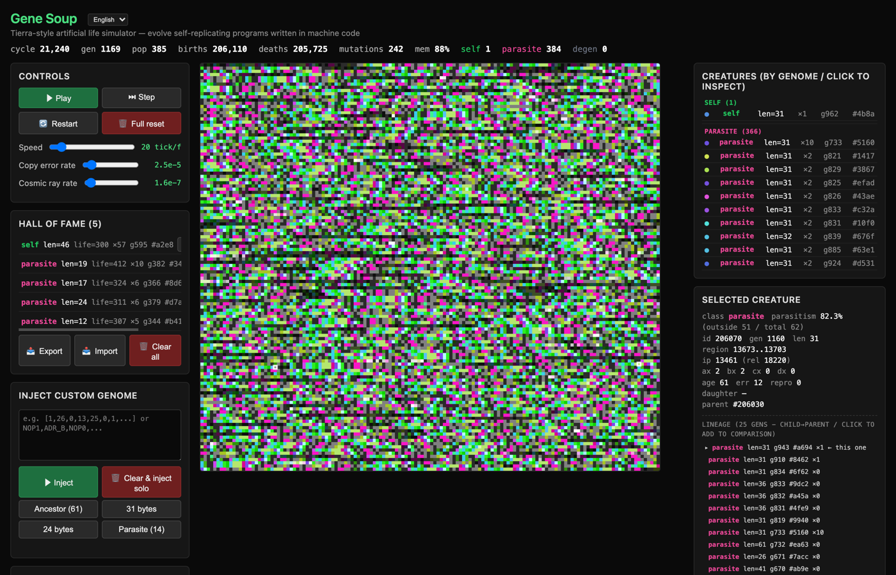

# Tierra — ブラウザ完結の人工生命シミュレーター

> [Claude Opus 4.7](https://www.anthropic.com/news/claude-opus-4) と [Claude Code](https://www.anthropic.com/claude-code) を使って共同制作しました。

Thomas Ray が 1990 年代初頭に作った **Tierra** にインスパイアされた、ブラウザで動く人工生命シミュレーターです。32 命令の仮想機械語で書かれた自己複製プログラムが共有メモリ上で CPU 時間とメモリを奪い合い、コピー時のビット反転と自然選択によって寄生体・超寄生体・縮退レプリケーターなどが自然発生します。

実装は素の HTML / CSS / ES modules のみ。バンドラ不要、`npm install` 不要です。

**🔗 デモ:** [asari-mtr.github.io/tierra](https://asari-mtr.github.io/tierra/)

**🌐 [English README](./README.md)**



---

## 背景

Tierra は Thomas S. Ray がダーウィン進化をデジタル基盤で再現するために設計したシステムです。61 バイトの「祖先」を共有メモリ "スープ" に投入すると、自分のコードを検索 → メモリ確保 → コピー → 分裂、というサイクルで増殖を開始します。コピー時のランダムなビット反転と、アイドル状態のメモリに降る「宇宙線」が変異を生み、メモリが満杯になると死神 (Reaper) が古く・エラー多発な個体から間引きます。

参考資料:
- Ray, T. S. (1991). [*An Approach to the Synthesis of Life*](https://tomray.me/pubs/zen/Approach.pdf). *Artificial Life II*, SFI Studies in the Sciences of Complexity, 11, pp. 371–408.
- [Tomray.me — Tierra publications](https://tomray.me/tierra-pubs)
- [Wikipedia — Tierra (computer simulation)](https://en.wikipedia.org/wiki/Tierra_(computer_simulation))

## 本家との差分

中核ダイナミクス (テンプレートアドレッシング、ゲノム長比例の Slicer、Reaper、コピー機構を借用する寄生体) は忠実に再現しつつ、**研究用ではなく可視化・体験用に簡略化**しています。

| 項目 | 本家 Tierra | この実装 |
| --- | --- | --- |
| 命令セット | 32 命令、5 ビットテンプレート | 同 32 命令、4 ビットテンプレート (NOP0/NOP1 ペア) |
| メモリサイズ | 可変 (典型 60k+ バイト) | 144 × 128 = 18,432 バイト固定 (トーラス状) |
| 突然変異 | コピー反転 + 宇宙線 + flaw | コピー反転 + 宇宙線 のみ |
| 生存能力チェック | 暗黙的 | 娘領域に最低 1 つの `DIVIDE` を要求 (自明な縮退体を抑制) |
| ジーンバンク | ディスク永続化された長寿命ゲノム集 | ブラウザ localStorage の「殿堂入り」 |
| UI | 専用解析クライアント (x11) | 単一 HTML + canvas + DOM パネル |
| 停滞時の救済 | 無し | N tick 出産が無いと自動淘汰 + 祖先再注入 |
| 比較ビュー | 無し | 任意の 2 ゲノム間で LCS 差分を `git diff` 風に表示 |
| 配布形態 | コンパイル済み C, マルチプロセス | 素の HTML + ES modules、完全クライアントサイド |

## 機能

- **メモリ可視化** — スープの各バイトを 1 ピクセルとして命令ごとに色分け表示。所有領域は明るく、空き領域は暗く描画。任意のピクセルをクリックすると、そのセルにいる個体を検査できます。
- **色相シフトパレット** — 命令カラーは時間とともにゆっくり色相回転 (演出)。
- **個体一覧** — ゲノム別 / カテゴリ別 (自立 / 寄生 / 縮退) に集計、個体数順にソート。
- **検査パネル** — 選択個体の分類、寄生率 (自領域外を読んだサイクル比)、レジスタ・IP、系統 (子→祖先)、ゲノム逆アセンブル表示。
- **ゲノム比較** — 系統リストの行をクリックして比較対象に追加。2 個選ぶと LCS ベースで挿入・削除・置換を git diff 風に色分け表示。
- **殿堂入り** — 長寿命かつ繁殖力の高いゲノム (lifespan ≥ 300 tick / 繁殖 ≥ 5 / len ≤ 55) を localStorage に自動保存。任意のタイミングで現在のスープに再注入可能。JSON でエクスポート/インポート。
- **カスタムゲノム注入** — JSON 配列または OP 名のカンマ区切りで自作個体を投入、または単独投入で新規スープを開始。
- **可変パラメータ** — コピー誤り率・放射線率・実行速度をスライダーで調整。
- **多言語 UI** — 英語 / 日本語をヘッダから切替可能。

## 命令セット

各セルは 5 ビットの opcode (0–31) を格納します。テンプレートアドレッシングは `NOP0`/`NOP1` の組をビットパターンとして使い、他命令がその*相補*パターンを検索します。算術は 3 つの整数レジスタ (`ax`, `bx`, `cx`) と書き込み先 (`dx`)、小型オペランドスタックで行います。

| Code | 命令名 | 動作 |
| ---: | --- | --- |
| 0 | `NOP0` | no-op、テンプレートビット `0` |
| 1 | `NOP1` | no-op、テンプレートビット `1` |
| 2 | `ZERO` | `cx = 0` |
| 3 | `OR1` | `cx |= 1` |
| 4 | `SHL` | `cx <<= 1` (シフト左、1 ビットずつ定数を組み立てる) |
| 5 | `INC_A` | `ax++` |
| 6 | `INC_B` | `bx++` |
| 7 | `INC_C` | `cx++` |
| 8 | `DEC_C` | `cx--` |
| 9 | `IFZ` | `cx == 0` のときだけ次命令を実行 |
| 10 | `IFNZ` | `cx != 0` のときだけ次命令を実行 |
| 11 | `SUB_BA` | `cx = bx - ax` |
| 12 | `MOV_AB` | `mem[bx] = mem[ax]` — **コピーの中核**。ここでビット反転変異が起きる |
| 13–16 | `PUSH_A/B/C/D` | レジスタをスタックへ push |
| 17–20 | `POP_A/B/C/D` | スタックからレジスタへ pop |
| 21 | `JMP_F` | 前方の相補テンプレートを探してジャンプ |
| 22 | `JMP_B` | 後方の相補テンプレートを探してジャンプ |
| 23 | `CALL` | 戻りアドレスを push し、テンプレート位置へジャンプ |
| 24 | `RET` | スタックから戻りアドレスを pop してジャンプ |
| 25 | `ADR_F` | 前方検索、テンプレート位置を `ax` に書き込む |
| 26 | `ADR_B` | 後方検索、同上 |
| 27 | `MAL` | `cx` バイトの空きを確保、開始位置を `dx` に書く |
| 28 | `DIVIDE` | 確保領域を新個体として切り離し |
| 29–31 | `NOP_X1/X2/X3` | 予備 no-op (変異吸収用) |

テンプレートは短い `NOP0`/`NOP1` 列で、検索系命令 (`JMP_*`, `ADR_*`, `CALL`) は*相補*テンプレートを探します。これにより個体は自分のコードの中の参照点を相対的に見つけられます。

## ローカル実行

ビルド不要、依存ゼロ。ES modules で分割しているため、`file://` 直接オープンではなく HTTP サーバ経由で開いてください:

```sh
python3 -m http.server 8000
# http://localhost:8000/
```

## ファイル構成

```
index.html              マークアップのみ (インライン CSS / JS なし)
css/styles.css          全スタイル
js/main.js              エントリポイント — DOM イベント配線とメインループ
js/constants.js         命令テーブル / VM・世界設定 / 祖先・サンプルゲノム
js/state.js             共有のミュータブル状態 (mem, owner, creatures, ...)
js/i18n.js              ja/en 辞書 + 翻訳ユーティリティ
js/colors.js            命令カラーパレット + 色相シフト
js/vm.js                VM コア: テンプレート / メモリ確保 / step / Reaper / tick
js/creatures.js         個体ライフサイクル: 生成・分類・genome 登録・系統
js/render.js            canvas 描画
js/ui.js                統計 / 個体一覧 / 検査パネル / 凡例
js/comparison.js        LCS ベースのゲノム比較ビュー
js/inject.js            カスタムゲノムの解析と投入
js/hall.js              殿堂入りのストレージと UI
```

## ライセンス

MIT — [LICENSE](./LICENSE) を参照。自由に使って、フォークして、変異させてください。

## 謝辞

- Tierra を発明し公開した Thomas S. Ray 氏。
- 本実装は [Claude Opus 4.7](https://www.anthropic.com/news/claude-opus-4) と [Claude Code](https://www.anthropic.com/claude-code) を使って共同制作しました。
